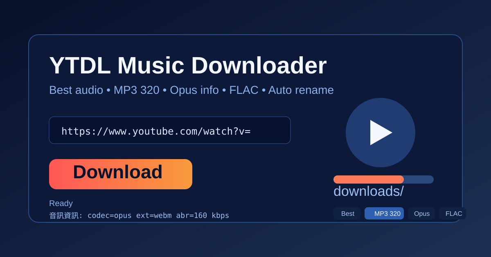
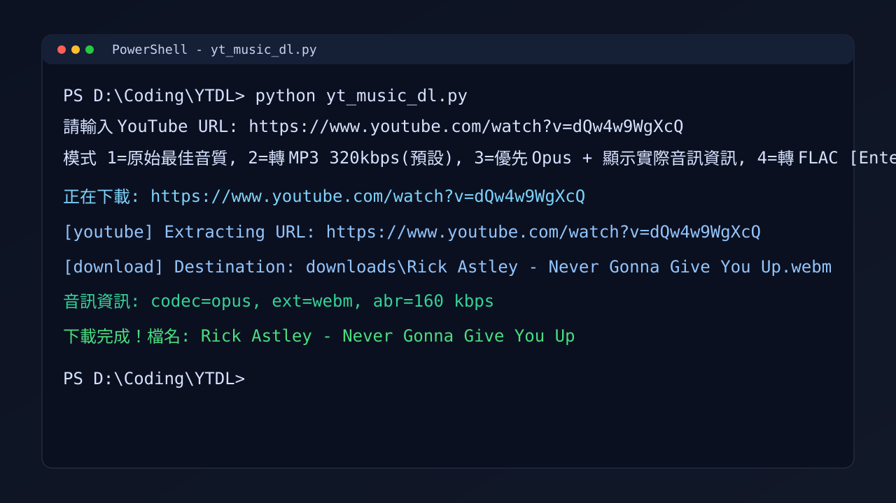

# YT Music Downloader



YouTube 音訊下載工具（Python + `yt-dlp`）。

## 實際執行畫面



## 功能
- 下載 YouTube 最佳音訊
- 模式 1：原始最佳音質（推薦）
- 模式 2：轉 MP3 320kbps
- 模式 3：優先 Opus + 顯示實際音訊資訊
- 模式 4：轉 FLAC
- 同檔名自動改名（`(1)`, `(2)`...），不覆蓋舊檔

## 環境需求
- Python 3.9+
- `yt-dlp`
- `ffmpeg`（模式 2/4 轉檔時需要）

## 安裝
```bash
pip install yt-dlp
```

## 使用
```bash
python yt_music_dl.py
```

## GUI 介面
```bash
python yt_music_gui.py
```

## 輸出
- 預設資料夾：`downloads/`

## 注意
- YouTube 音訊來源有上限，轉高碼率不會創造新音質。
- 想保留最高可得品質，建議使用模式 1 或模式 3。

## 免責聲明
- 本專案僅供個人學習與技術研究使用。
- 請在遵守 YouTube 服務條款、著作權法與所在地法律的前提下使用。
- 使用者需自行承擔因使用本工具所產生的任何法律責任與風險。
- 專案作者與貢獻者不對任何濫用行為負責。

## Credits
- 開發協作：OpenAI Codex
